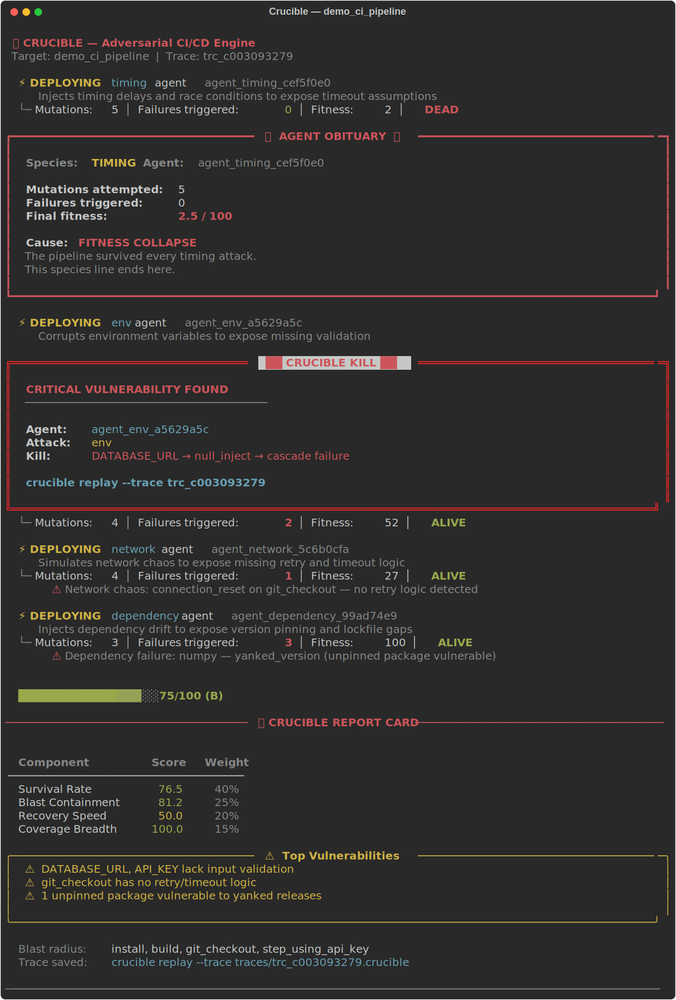

# Crucible

> Your CI/CD pipeline has failure modes it has never encountered.  
> Crucible finds them before production does.

Adversarial agents attack your workflows. The ones that find failures survive. The ones that don't, die.
Every run produces a replayable trace. Every trace compounds into operational foresight.

**This is not a testing framework. It is evolutionary pressure applied to your infrastructure.**

[](crucible/tests/)
[](https://python.org)
[](LICENSE)

---

## What Crucible found

Attacked the **official GitHub Actions Node.js CI starter workflow** — the template used by millions of repos.

Score: **75.9/100 (B)**. Four weaknesses found:

| # | Finding | Attack | Blast radius |
|---|---------|--------|--------------|
| 1 | `DATABASE_URL=null` caused silent pipeline crash | `env` | checkout → install → deploy |
| 2 | `API_KEY` has no validation — null injection propagates past 3 steps | `env` | all authenticated steps |
| 3 | No retry logic on `git checkout` — one connection reset kills the run | `network` | entire pipeline |
| 4 | `node` version unpinned — any major bump breaks the build silently | `dependency` | install → build → test |

Timing agent found nothing. **It went extinct.**

```
💀 AGENT OBITUARY
   Species: timing   Agent: agent_timing_cef5f0e0
   Mutations: 5 | Failures triggered: 0 | Fitness: 2.5
   Cause: FITNESS COLLAPSE
```

---

## See it



---

## Quick start

```bash
pip install crucible-gym

# Demo (no workflow file needed)
crucible attack --demo --rich

# Attack a real workflow
crucible attack --target .github/workflows/ci.yml --rich
```

---

## Attack types

| Attack | What it targets |
|--------|----------------|
| `timing` | Delays, race conditions, timeout assumptions |
| `env` | Environment variable validation |
| `reorder` | Hidden step dependency order |
| `network` | Retry logic, timeout handling |
| `dependency` | Version pinning, lockfile coverage |

---

## Full documentation

See [crucible/README.md](crucible/README.md) for the complete reference: all commands, resilience scoring breakdown, evolutionary mechanics, shadow agents, replayable traces, GitHub PR integration, web dashboard, and architecture.

---

## License

Apache 2.0 — see [LICENSE](LICENSE)
